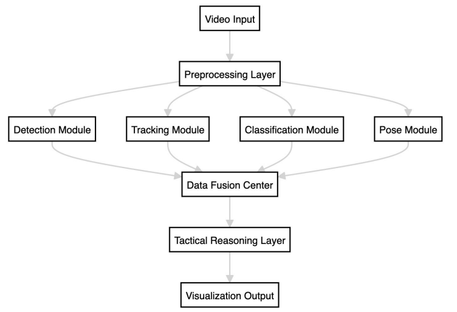
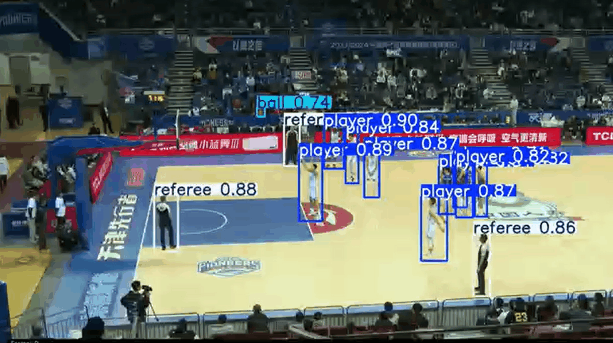
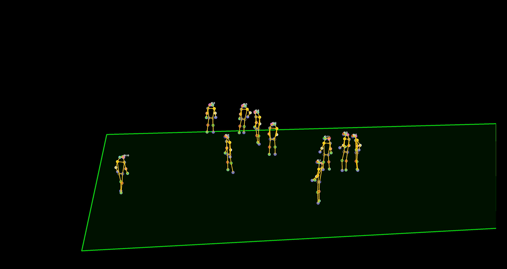
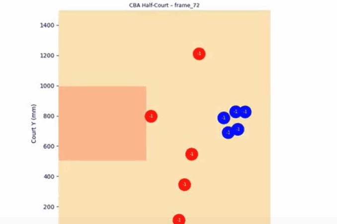

PoseVision is an end-to-end deep learning pipeline for basketball video understanding integrating YOLOv11, DeepSORT, and RTMPose.
# PoseVision: AI-Powered Basketball Video Analytics

PoseVision is an end-to-end computer vision pipeline designed for automated basketball video analysis.  
The system integrates object detection, multi-object tracking, team classification, and human pose estimation to extract structured information from raw basketball game footage.

This project was initially developed as an **independent undergraduate research project** and later expanded into a **SURF research project**.

---

## Project Overview

Modern sports analytics increasingly relies on automated video understanding.  
However, basketball video analysis remains challenging due to:

- rapid player movement
- frequent occlusions
- multiple interacting objects
- complex tactical structures

PoseVision addresses these challenges by building a **modular deep learning pipeline** capable of extracting player trajectories, poses, and spatial formations from broadcast basketball footage.

The system generates structured outputs that can support:

- tactical analysis
- performance evaluation
- intelligent broadcasting
- sports data mining

---

## System Architecture

The PoseVision framework integrates several state-of-the-art computer vision modules into a unified pipeline.

The modular architecture ensures scalability and robustness in complex sports video scenarios.

### Architecture Diagram



---

## Demo

Example outputs from the PoseVision system include:

### Player Detection & Tracking



### Pose Estimation



### 2D Tactical Projection



The system outputs structured JSON data including:

- bounding boxes
- player identities
- team labels
- pose keypoints
- projected court coordinates

---

## Key Features

### Player & Referee Detection

- YOLOv11-based real-time detection
- Detects players, referees, and the basketball

### Multi-Object Tracking

- DeepSORT maintains consistent identities across frames
- Robust to occlusions and fast movement

### Team Classification

- K-Means clustering on HSV color histograms
- Semi-automatic correction improves accuracy

### Pose Estimation

- RTMPose-S model for real-time human keypoint detection
- Predicts 17 COCO-format body keypoints per player

### Tactical Projection

- Player coordinates projected to a 2D basketball court
- Enables spatial and tactical analysis

---

## Dataset

The dataset was constructed from real professional basketball game videos.

Dataset statistics:

- Resolution: 3840×2160
- Frame rate: 50 FPS
- Total frames: ~30,000
- Annotated frames: 2,000

Annotations follow the COCO format and include:

- players
- referees
- basketball
- ball
Data augmentation techniques include:

- brightness adjustment
- contrast enhancement
- geometric transformations

---

## Experimental Results

Preliminary experiments demonstrate promising performance.

| Module | Metric | Result |
|------|------|------|
Detection | mAP | 96.1% |
Tracking | MOTA | 82.1% |
Team classification | Accuracy | ~95% |
Pose estimation | PCK | >83% |

The system shows stable detection, identity tracking, and pose estimation on real basketball game videos.

---


## Repository Structure

```
PoseVision
│
├── assets
│   ├── pipeline.png            # system architecture diagram
│   ├── tracking.gif            # demo: player tracking
│   ├── pose.gif                # demo: pose estimation
│   └── projection.gif          # demo: 2D court projection
│
├── yolo_detection              # YOLOv11 detection module
├── tracking                    # DeepSORT multi-object tracking
├── pose                        # RTMPose inference module
├── classify                    # team classification module
├── court                       # 2D court projection and mapping
│
├── configs                     # model configuration files
├── utils                       # helper functions and utilities
├── weights                     # pretrained model weights
│
├── input                       # input videos / frames
├── output                      # processed outputs
├── results                     # experiment results and visualization
│
├── main.py                     # main pipeline entry
├── requirements.txt            # dependencies
└── README.md
```
---

## Installation

Clone the repository and install dependencies.

```bash
git clone https://github.com/Yingbo-Jiao/PoseVision
cd PoseVision
pip install -r requirements.txt
